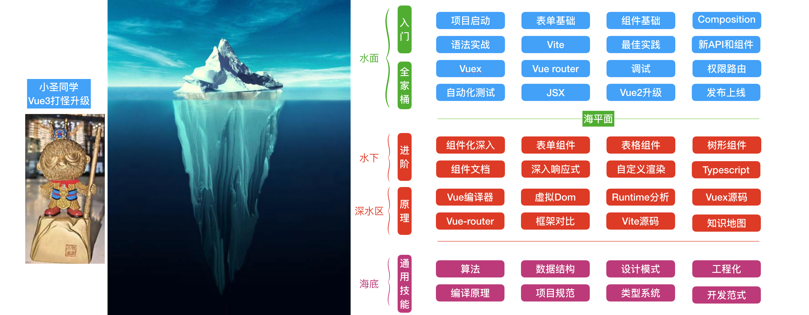

# self-employed-workbook
写给自己的程序员自由职业工作手册（日常更新中）

2021.8.31自由职业正式开工，记录一下日常心得，希望对有志于做自由职业的大兄弟有所帮助

## 里程碑

* 2021.9.1 
  * 提离职后在家休息一周，正式开工搞自由职业
  * 在家把桌子整理了一下作为工位  [视频](https://www.bilibili.com/video/BV1G64y1Y7CU/)
  * 思考自由职业要干啥  [视频](https://www.bilibili.com/video/BV1BP4y1a7WE)
* 2021.9.4
  * 先写一些前端的教程，注册了一个土嗨的npm备用
  * 
* 9.6 根据冰山模型画了个学vue的进阶图，欢迎大家给点意见
  * 

## 日常思考

#### [关于做自由职业的思考 【Bilibili】](https://www.bilibili.com/video/BV1BP4y1a7WE)

#### [先整理出一个快乐的工位](https://www.bilibili.com/video/BV1G64y1Y7CU/)

#### 自由职业，就是越过公司，自己和市场交换价值

####  工作和生活的分离

#### 工作的本质

#### 用户是需求的合集

