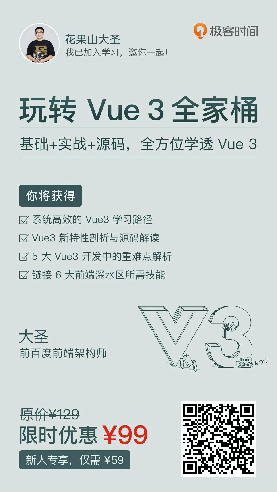

# self-employed-workbook
写给自己的程序员自由职业工作手册（日常更新中）

2021.8.31自由职业正式开工，记录一下日常心得，希望对有志于做自由职业的大兄弟有所帮助

2021.9.24 除了培训，怎么才算是教育呢 （澡堂子里的思考）:fountain:

## 里程碑

* 2021.9.1 
  * 提离职后在家休息一周，正式开工搞自由职业
  * 在家把桌子整理了一下作为工位  [视频](https://www.bilibili.com/video/BV1G64y1Y7CU/)
  * 思考自由职业要干啥  [视频](https://www.bilibili.com/video/BV1BP4y1a7WE)
* 2021.9.4
  * 先写一些前端的教程，注册了一个土嗨的npm备用
  * 
* 9.6 根据冰山模型画了个学vue的进阶图，欢迎大家给点意见
  * 
* 9.8 制定作息
  * 5:30起床 运动+吃早饭
  * 7:30 看书 or coding 
  * 12:00 打游戏 午睡 
  * 14:00 看书 or coding or出去浪
  * 18:00 媳妇到家 && 下班  && 打游戏 && 遛狗
  * 23:00之前睡觉
  * 写几个vscode，eslint插件来控制一下时间
  * 拒绝沉迷编程，拒绝沉迷游戏
* 9.10
  * 购买hugsun.fun域名，作为以后花果山学堂的域名把
* 9.24
  * 最近在一直写课件，参考上面的Vue进阶图
  * 10月就会有专栏和课程发布  Vue React主题
* 9.29 
  * 抖音学浪开通 试试抖音直播卖课
  * 准备做一个前端刷面试题的小程序
* 9.30 和极客时间合作，准备推出《Vue3》的专栏
* 10.18 第一个里程碑，[《玩转Vue3全家桶》](http://gk.link/a/10BoB)上线啦，欢迎转发
  * 
* 10.23 参加早早聊Vue专场 

## 日常思考

#### 程序员不上班怎么搞到钱

1. 付费课程 :heart:
  * 第一步要做的，我擅长的
  * 文字专栏
  * 录播课程
  * 直播课程
2. 写书
  * 赚名声
3. 开源
  * 开源捐赠
  * 付费pro版本
4. 独立软件
  * 自己做一个在线教育小平台 (规划ing)
  * 自己做app
  * 自己做小程序 (擅长的，已经启动) :heart:
5. 自媒体
  * 广告收入我不擅长，但是可以作为销售课程 在做ing
6. 远程外包  （我不感兴趣）
  * http://freelancer.com
  * https://www.upwork.com/
7. 投资理财 (不擅长)

#### [关于做自由职业的思考 【Bilibili】](https://www.bilibili.com/video/BV1BP4y1a7WE)

#### [先整理出一个快乐的工位](https://www.bilibili.com/video/BV1G64y1Y7CU/)

1. 自由职业，就是越过公司，自己和市场交换价值
2. 你自己就是一个团队，运营，产品，技术，商业都需要你自己带领自己
3. 工作和生活的分离
4. 用户是需求的合集 （俞军）

