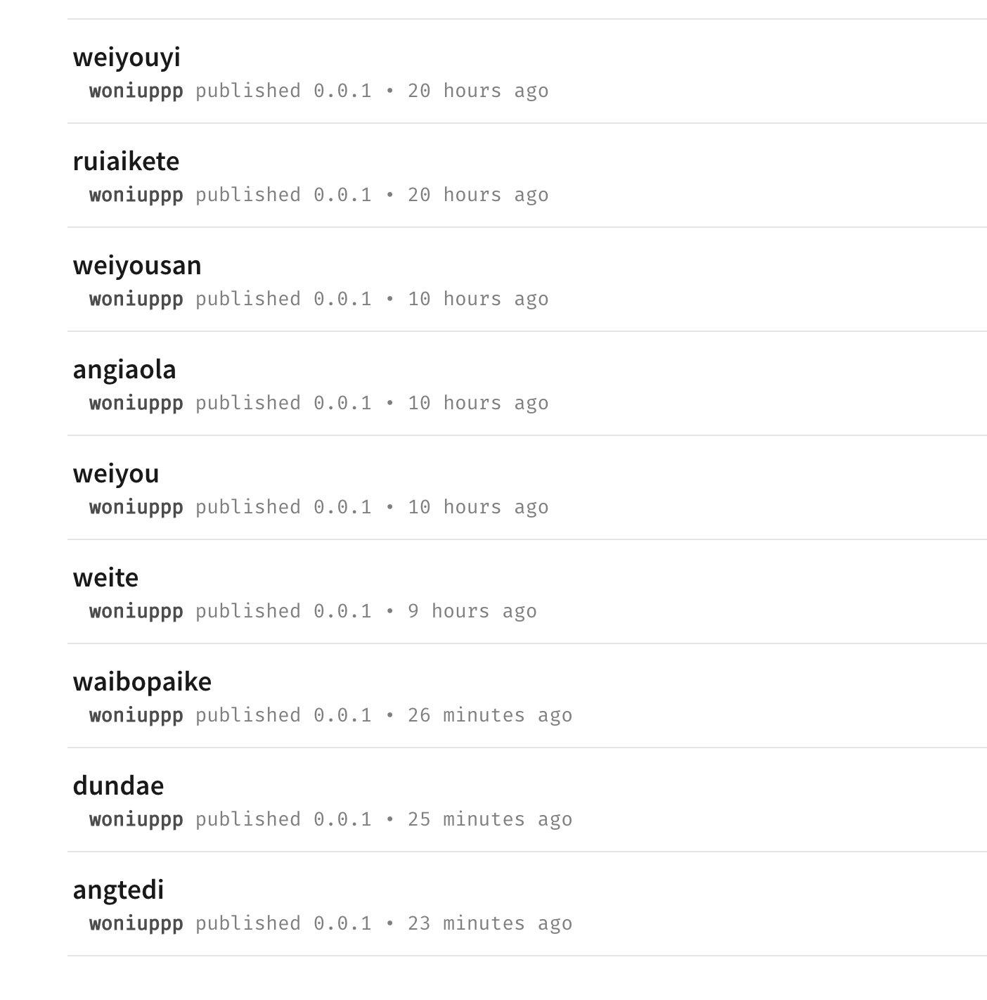
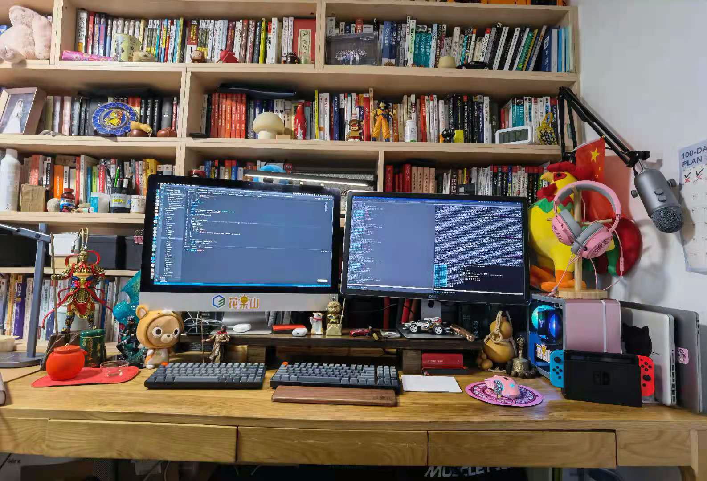

# self-employed-workbook
写给自己的程序员自由职业工作手册（日常更新中）

2021.8.31自由职业正式开工，记录一下日常心得，希望对有志于做自由职业的大兄弟有所帮助

## 里程碑

* 2021.9.1 
  * 提离职后在家休息一周，正式开工搞自由职业
  * 在家把桌子整理了一下作为工位  [视频](https://www.bilibili.com/video/BV1G64y1Y7CU/)
  * 思考自由职业要干啥  [视频](https://www.bilibili.com/video/BV1BP4y1a7WE)
* 2021.9.4
  * 先写一些前端的教程，注册了一个土嗨的npm备用
  * 
* 9.6 根据冰山模型画了个学vue的进阶图，欢迎大家给点意见
  * 
* 9.8 制定作息
  * 5:30起床 运动+吃早饭
  * 7:30 看书 or coding 
  * 12:00 打游戏 午睡 
  * 14:00 看书 or coding or出去浪
  * 18:00 媳妇到家 && 下班  && 打游戏 && 遛狗
  * 23:00之前睡觉
  * 写几个vscode，eslint插件来控制一下时间
  * 拒绝沉迷编程，拒绝沉迷游戏

## 日常思考

#### [关于做自由职业的思考 【Bilibili】](https://www.bilibili.com/video/BV1BP4y1a7WE)

#### [先整理出一个快乐的工位](https://www.bilibili.com/video/BV1G64y1Y7CU/)

1. 自由职业，就是越过公司，自己和市场交换价值
2. 你自己就是一个团队，运营，产品，技术，商业都需要你自己带领自己
3. 工作和生活的分离
4. 用户是需求的合集 （俞军）

